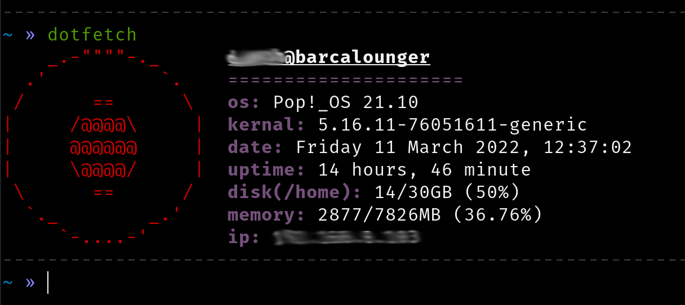

<p align="center">
    
</p>

<h1 align="center">dotfetch</h1>

<p align="center">Well ya, its another neofetch like application. only difference is that it does not look so posh and the code is shit. But dont blame me, im still new to bash</p>

how to install

```
$ git clone https://github.com/TheDucky/dotfetch.git
$ cd dotfetch
$ cp dotfetch.sh /usr/bin/dotfetch
$ dotfetch
```

### thank you!
